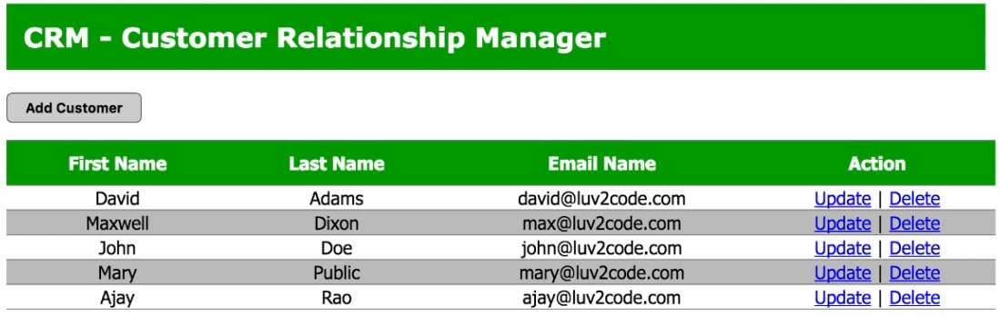

# Aplicação WEB utilizando Spring MVC e Hibernate

Primeiro projeto WEB do curso utilizando os conhecimentos adquiridos de Spring MVC e Hibernate.

## Objetivos do projeto:
	1. Configurar ambiente do banco de dados
	2. Listar Customers
	3. Adicionar novos Customer
	4. Atualizar Customer
	5. Deletar Customer
	
## Resultado esperado

## Configurar ambiente do banco de dados

É feito executando os scripts de criação do banco. A autenticação é a seguinte:
Usuario: springstudent
Password: springstudent

