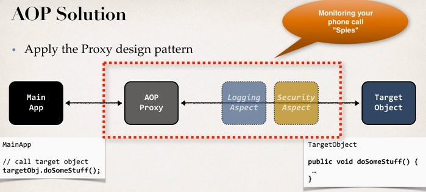

# Aplicação WEB utilizando Spring AOP

Primeiro projeto WEB do curso utilizando os conhecimentos adquiridos de Spring MVC e Hibernate.

Projeto para demonstrar o funcionamento do Spring AOP, utilizando conhecimentos de Aspect-Oriented Programming.

## Objetivos do projeto:

	1. Demonstrar como funciona o AOP
	2. Mostrar em prática os diferentes tipos de Advice
	3. Detalhes sobre Pointcut Expressions
	4. JoinPoints
	5. Ordenando Aspects
	6. Criando Aspects
	7. Adicionando Logging AOP para o projeto com Spring MVC
	
## Arquitetura

O Spring AOP utiliza a *proxy pattern*, utilizando o weaving *run-time*.

## O que o projeto utiliza

O projeto utiliza as seguintes tecnologias do AOP
* Advice Types
	* @Before
	* @AfterReturning
	* @AfterThrowing
	* @After
	* @Around
* JoinPoints (capturar retorno)
* Captura e modificação de retorno
* @Order
* Pointcut expressions
* Pointcut Declaration

